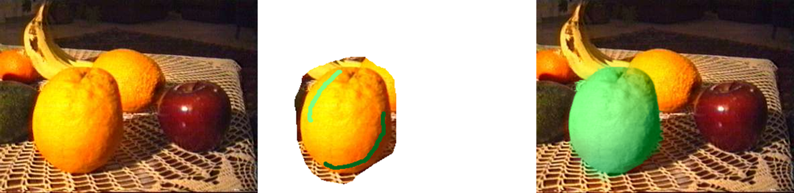

# Colorization-tkinter
Implementation of "Colorization using Optimization" by Levin et al. 2004 using Cython and tkinter interface.  
Project web page: https://www.cs.huji.ac.il/~yweiss/Colorization/
   
  
  
## Libraries you will need
The following is a list of Python libraries you have to install:  
- cv2 (OpenCV)
- Cython
- Matplotlib
- NumPy
- SciPy
- Pillow
- scikits.umfpack (Scikit-learn umfpack)
- Tkinter  
   
You will need to have a C compiler installed on your system, please refer to this [page](https://cython.readthedocs.io/en/latest/src/quickstart/install.html) for Cython setup. In my system, I used Windows 10 x64 with Visual Studio 2015 C/C++ Compiler installed.  
   
## Usage
### Building Cython Files
If you have a Windows x64 system with Python version 3.6, you can just run `main.py` (I have provided built Cython files). In other case, you need yo build it yourself by `cd` to the root (this repository folder), open command prompt and type:  
  
`python setup.py build_ext --inplace`  
  
One more thing, sometimes Cython building will fail if you have opened an IPython console, in that case you just need to close it first before building `colorizationCy.pyx`. More in Cython file compiling please refer to this [guide](https://cython.readthedocs.io/en/latest/src/quickstart/build.html).  
  
### Using the Interface
Because I used the `ImageGrab` Pillow library to get the canvas content, it will fail on scaled screen, especially on laptop screen where you have high-resolution display (>=1080p). Please use 100% (normal scale) display. For Windows 10 users you just need to click the 'Start' button and click 'Gears' icon (open Settings) above the 'Power' button, then go to 'System' and choose 'Display' on the left pane, then change the scaling in 'Scale and Layout' section.  
The image will be resized to fit the 320 by 265 canvas size, then if you want to save the marked and colourized image results it will be resized back to their original size. To start colouring, you don't actually need to apply colour to every object of interests at first, you can progressively colour them one by one. For recolouring, you can use white brush to mask the part of image you don't want to recolour. Please note that I didn't implement video colourization from the paper.
  
## Results
### Runtime
On average, the time needed to build weighting matrix is around 0.7 second(s) and solving sparse matrix around 0.7 to 1 second(s).
### Colorization

### Recolouring

